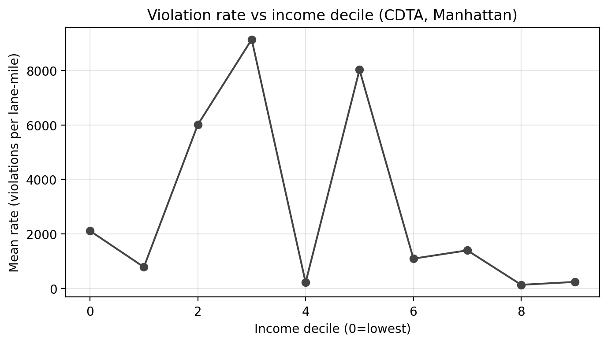

## 2025 MHC++ Datathon — ACE Violations in Manhattan

Make ACE operations more actionable. We measure normalized violation rates (violations per bus‑lane mile) to identify where and when to act in Manhattan, and how rates vary by income. Results are delivered as an interactive map and a React dashboard.

### Quick Links
- Live site: https://JC989.github.io/MHC_datathon_project/
- Interactive map: `reports/dashboards/map_manhattan_quickcheck.html` (embedded on the site)
- Story write‑up: `story_framework.md`
- Code for the site: `src/datathon`

### 2‑Minute Video

<video width="600" controls>
  <source src="reports/video/video_MHC++.mp4" type="video/mp4">
  Your browser does not support the video tag.
</video>

---

## TL;DR — Findings
- Equity: Lower‑income districts have higher normalized violation rates (large positive equity gradient).
- Schools (100 m): Near‑school shares spike at 7–9 AM and 2–4 PM.
- Hospitals (100 m): Morning ramp (7–8 AM), strongest mid‑day/PM concentration (peak at 2 PM); no late‑night spike.
- Where/When Playbook: Top NTA × hour windows to prioritize staffing and curb/loading adjustments.

| KPI | Value (from processed CSVs) |
| --- | --- |
| Mean rate (violations / lane‑mile) | computed from `rates_by_nta_hour_manhattan.csv` |
| Peak near‑hospital hour | computed from `proximity_hospitals_hourly_share_mn.csv` |
| Equity gradient (Decile 0 vs 9) | from `equity_rates_by_income_decile_mn.csv` |

Screenshots:




---

## Research Questions
- RQ1 – Equity (normalized): Are violation rates per bus‑lane mile higher in lower‑income neighborhoods?
- RQ2 – Schools (100 m): Within 100 m of schools (incl. CUNY), do rates spike at 7–9 AM and 2–4 PM vs other hours?
- RQ3 – Hospitals (100 m): Within 100 m of hospitals, do rates spike at 6–8 AM, 2–4 PM, 10–11 PM?

Definitions:
- Rate = violations / lane‑miles (by `NTA × hour`)
- Equity gradient = ((rate in income decile 0 − decile 9) / decile 9) × 100
- Share near POI = near_POI / total violations that hour

---

## Methodology (high‑level)
1) Fetch Manhattan slices (ACE, bus lanes, NTAs, schools, hospitals) and compute lane‑miles by intersecting bus lanes with NTA polygons (EPSG:2263).
2) Join ACE points to NTAs, extract hour of day, aggregate violations by `NTA × hour`, compute `rate = violations / lane_miles`.
3) Buffer schools/hospitals by 100 m (EPSG:2263), flag nearby ACE points, compute hourly shares near POIs.
4) Map NTA→CDTA using crosswalk (`hm78-6dwm`), aggregate lane‑mile–weighted rates to CDTA; join ACS‑derived income; compute deciles and equity gradient.
5) Rank top NTA × hour windows and publish a playable action table (Where/When Playbook).

Geospatial/technical:
- Storage/tiles: EPSG:4326; distances/buffers/lengths: EPSG:2263
- SoQL filters and `$limit`/`$offset` pagination on Socrata; hourly aggregation from timestamps
- Folium for map; React + Vite for the dashboard

---

## Data Sources
- ACE Violations: `kh8p-hcbm` — `https://dev.socrata.com/foundry/data.cityofnewyork.us/kh8p-hcbm`
- ACE Enforced Routes (context): `ki2b-sg5y` — `https://dev.socrata.com/foundry/data.cityofnewyork.us/ki2b-sg5y`
- Bus Lanes – Local Streets: `ycrg-ses3` — `https://dev.socrata.com/foundry/data.cityofnewyork.us/ycrg-ses3`
- NTAs 2020: `9nt8-h7nd` — `https://dev.socrata.com/foundry/data.cityofnewyork.us/9nt8-h7nd`
- Schools (DOE): `s3k6-pzi2` — `https://dev.socrata.com/foundry/data.cityofnewyork.us/s3k6-pzi2`
- NYC Health + Hospitals: `q6fj-vxf8` — `https://dev.socrata.com/foundry/data.cityofnewyork.us/q6fj-vxf8`
- NTA/CDTA–Tract Equivalency: `hm78-6dwm` — `https://dev.socrata.com/foundry/data.cityofnewyork.us/hm78-6dwm`

Notes:
- Socrata APIs default to 1,000 rows; use SoQL `$limit`/`$offset` and `$where`.
- Reproject to EPSG:2263 for distances/lengths.

---

## Repository Structure (key paths)
```
.
├── data/
│   ├── raw/                      # NYC Open Data slices
│   └── processed/                # canonical artifacts for the site
├── notebooks/                    # end-to-end analysis (fetch → process → viz)
│   ├── 01_ace_violations_data_fetch.ipynb
│   ├── 02_ace_violations_processing.ipynb
│   └── 06_ace_violations_visualization.ipynb
├── reports/
│   └── dashboards/
│       └── map_manhattan_quickcheck.html
├── src/
│   ├── ace_violations_analysis.py       # helper/legacy; not used in final pipeline
│   └── datathon/                 # React/Vite site
│       ├── public/               # img/, data/processed/, reports/
│       ├── src/
│       │   └── App.jsx
│       └── vite.config.js
├── .github/workflows/pages.yml   # GitHub Pages deploy workflow
└── README.md
```

---

## Run Locally
```bash
cd src/datathon
npm install
npm run dev
# open the printed URL (e.g., http://localhost:5173)
```

### Build
```bash
cd src/datathon
npm run build
```

### Deploy to GitHub Pages
This repo is pre‑configured:
- `vite.config.js` sets `base` for Pages when `GITHUB_PAGES` is true
- `App.jsx` references assets via `import.meta.env.BASE_URL`
- GitHub Actions workflow publishes `src/datathon/dist`

Steps:
1) Merge to `main`
2) Settings → Pages → Source: GitHub Actions (one‑time)
3) Site: https://JC989.github.io/MHC_datathon_project/

Troubleshooting:
- 404s for images/CSV/map → ensure paths use `${import.meta.env.BASE_URL}` and rebuild
- Cached assets → hard refresh (Cmd+Shift+R)

---

## Reproducibility
Primary artifacts used by the site are in `data/processed/` and can be regenerated following the steps in Methodology using scripts/utilities in `src/`. Key outputs:
- `data/processed/rates_by_nta_hour_manhattan.csv`
- `data/processed/equity_rates_by_income_decile_mn.csv`
- `data/processed/proximity_schools_hourly_share_mn.csv`
- `data/processed/proximity_hospitals_hourly_share_mn.csv`
- `data/processed/where_when_action_playbook_mn.csv`
- `reports/dashboards/map_manhattan_quickcheck.html`

Notes:
- The full workflow is documented and executed in the Jupyter notebooks under `notebooks/`.
- The standalone script `src/ace_violations_analysis.py` is provided for reference only and is not used in the final build/deploy pipeline.

---

## Team, Mentor, and Credits
- Team: **Mohamed Hiba**, **Jean Carlo Chajon**, **Shazadul Islam** - Data@CCNY
- Consulted: **@sudiptobt** (prior Datathon winner)
